# FotoDif

## Introducción

El objetivo de este programa es facilitar las herramientas necesarias para la confección de serires fotométricas largas, tanto de magnitud relativa como absoluta, que pueden extenderse varias horas. Dispone también de dos secciones dedicadas a la búsqueda de variables de periodo corto y al análisis de periodos.

FotoDif es capaz de hacer el seguimiento de objetos móviles a través del campo, por lo que también es útil para el estudio, por ejemplo, de la rotación de asteroides. En el resto de manual, la referencia a variables se aplica indistintamente también a asteroides.

> **Importante: varias noches.** No es conveniente intentar el proceso de imágenes correspondientes a noches diferentes para realizar la medida de variables ni para el empleo de la herramienta auxiliar de [búsqueda de variables](http://www.astrosurf.com/orodeno/fotodif/fotodif.html#9). FotoDif está diseñado para medir series de imágenes en los que el cambio de brillo de las estrellas o los cambios de posición del campo o de posibles asteroides sean suaves. El procedimiento correcto para realizar medidas de varias noches es procesar por separado las imágenes de cada una y eventualmente guardar por separado los datos de las estrellas de interés para analizarlas con la [herramienta de análisis de periodo](http://www.astrosurf.com/orodeno/fotodif/fotodif.html#10). En caso contrario pueden aparecer medidas incorrectas, y sobre todo, el funcionamiento incorrecto de la búsqueda de variables.

## Para empezar

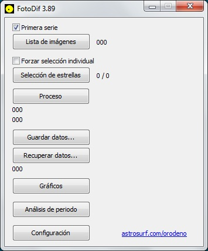

Es conveniente en primer lugar abrir la ventana de configuración donde fijaremos algunos parámetros importantes. Por ahora es necesario configurar los apartados "Sistema óptico", "Fotometría" y "Observatorio". Más adelante veremos los demás.

La sección "Fotometría" es tal vez la más importante, ya que se fijan los tamaños de las distintas áreas circulares que serviran para el cálculo. La primera servirá para leer la luz de las estrellas, la segunda hace de separador y la tercera sirve para calcular el brillo del fondo.

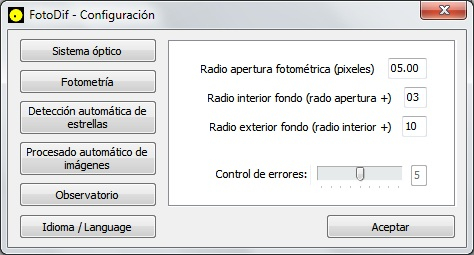
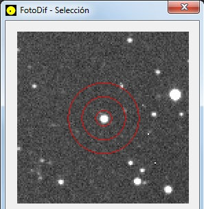

Es importante que la primera área abarque toda o casi toda la luz de las estrellas, pero no tanto que incluya mucho fondo de cielo, y que la segunda sea lo bastante grande como para que la tercera no se vea contaminada por las estrellas más brillantes.

En esta sección aparece también el [control de tolerancia de errores](http://www.astrosurf.com/orodeno/fotodif/fotodif.html#5).

## Lista de imágenes

A continuación ya podemos pasar a realizar medidas. Desde [este enlace](http://www.astrosurf.com/orodeno/fotodif/v.rar) puedes descargar las imágenes empleadas para la confección del manual y practicar con ellas.

> **Importante: Primera serie.** FotoDif permite (o se verá obligado, ya lo veremos) a procesar la serie de imágenes en varias sesiones. La casilla "Primera serie" sirve para indicar al programa que se trata de la primera vez. Si está marcada el programa borrará los datos previos y comenzará un cálculo nuevo. Si está desmarcada añadirá los datos que se midan a los anteriores. Antes de proceder al cálculo aparecerá siempre una ventana recordando la situación.

Pulsando sobre el botón "Lista de imágenes", FotoDif abrirá un cuadro de diálogo que nos permitirá localizar las imágenes a tratar. A continuación presentará una ventana con datos importantes que deberemos completar si no se han podido extraer de la cabecera fit:

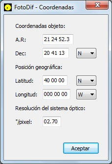

Y a continuación realizará unos cálculos preliminares y presentará junto al primer botón la cantidad de imágenes leídas.

## Selección de estrellas

Pulsando este botón, el programa abrirá la ventana con todo lo necesario para seleccionar las estrellas de calibrado y variables de interés:

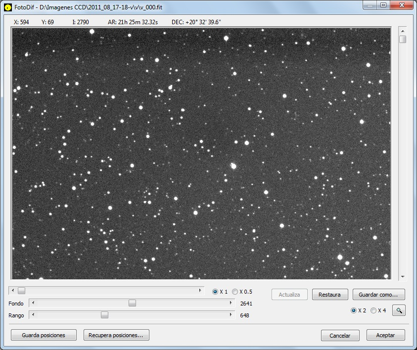

Con el botón :mag: se abrirá una ventana auxiliar que mostrará ampliada la zona alrededor del cursor.

> **Importante: desplazamiento del cursor.** Siempre que esta ventana esté abierta, podemos desplazar el cursor con las flechas del teclado.

Al hacer clic sobre una estrella o al pulsar "Enter" se abrirá una nueva ventana donde introduciremos sus datos:

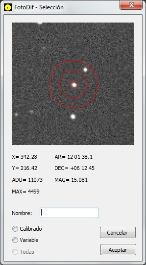

En primer lugar seleccionaremos "Calibrado" o "Variable" según corresponda, y a continuación introduciremos el nombre de la estrella. FotoDif aplica un nombre por defecto que se puede sustituir. Si la cabecera fit de la imagen contiene información fotométrica, clave "MZERO", el programa calculará la magnitud correspondiente a las aperturas fotométricas seleccionadas y la presentará en la ventana. Y a continuación, si la cabecera contiene la clave "FILTER", el nombre del filtro empleado.

> **Importante: Magnitud absoluta.** Si más adelante queremos calcular datos de magnitud absoluta, es necesario dar al programa las magnitudes de las estrellas de **calibrado** escribiendo estas en el lugar correspondiente al nombre, eventualmente seguida de un espacio y el nombre del filtro empleado. Sugiero emplear [esta referencia de la AAVSO](http://www.aavso.org/aavso-extended-file-format). Si esta información está presente, conforme con el párrafo anterior, pasará automáticamente al nombre de la estrella de calibrado, aunque se podrá modificar en la caja de edición.

> **Importante: Prevención de la saturación.** Durante la toma de una serie larga de imágenes, la transparencia atmosférica puede variar de forma sustancial. Por ejemplo, si empezamos cerca del horizonte aumentará considerablemente al ir ganando altura. El tiempo de exposición debe ser elegido teniendo en cuenta este factor. Tal vez sea conveniente hacer alguna imagen de prueba y controlar las estrellas para evitar este problema que tener que tirar varias horas de trabajo. En la ventana de selección de estrellas aparece, como guía, el valor del pixel más brillante de cada una.

Anillo de cálculo del fondo. Al comentar la configuración de los anillos fotométricos vimos que era importante que el tercero no se viera contaminado por la estrella que pretendemos medir (o que utilizamos para calibrar). Ahora es el momento de decir que no importa si en este anillo aparece "otra" estrella. FotoDif se encarga de que no afecte a la medida.

Una vez aceptados los datos, FotoDif volverá a la ventana anterior, marcará la estrella seleccionada y permitirá seguir añadiendo más. Al final veremos algo así:

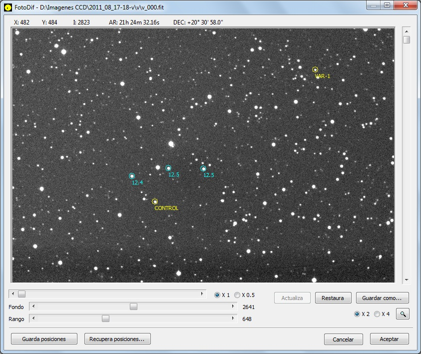

Una vez marcadas todas las estrellas, un par de cosas interesantes:

- Con "Guardar como..." podemos grabar una imagen jpg del campo, que será útil más adelante como referencia.
- Con "Guarda posiciones..." podemos guardar un archivo de texto con los datos de todas las estrellas, que será útil si más adelante necesitamos volver a marcarlas.
- Con "Recupera posiciones..." invertimos el proceso: marcamos todas las estrellas a partir de un archivo guardado sin necesidad de repetir una por una.

El resto de los botones y deslizadores sirven para cambiar el aspecto de la imagen.

Si sufrimos un error al marcar la estrella de referencia, la primera variable, no pasa nada. Pulsamos sobre "Cancelar" y repetimos el proceso.

Al aceptar esta ventana, junto al segundo botón se actualizará la cantidad de estrellas de calibrado y variables. Es necesario haber marcado al menos una de cada clase para que el programa permita continuar.

> **Importante: Segunda serie y siguientes.** Si por cualquier motivo se divide el proceso de las imágenes (ver sección siguiente), al llegar a la ventana de selección de estrellas el proceso es ligeramente distinto: FotoDif pedirá que localicemos la primera variable, y a continuación localizará y marcará el resto de las estrellas.

En algunos casos (por ejemplo, seguimiento de asteroides) puede ser necesario volver a marcar manualmente las estrellas de calibrado y variables. En este caso, antes de pulsar el botón "Selección de estrellas", marcaremos la casilla "Forzar selección manual". De esta manera podremos marcar una a una las estrellas de interés. Es muy importante que estas estrellas sean **exactamente las mismas** que se marcaron en la primera serie ya que FotoDif no puede hacer esta comprobación, y si hay alguna diferencia más tarde pueden aparecer errores difíciles de controlar. Por eso sólo se empleará este procedimiento cuando sea imposible la selección automática descrita en el párrafo anterior.

## Proceso

Todo listo. Pulsamos el botón correspondiente y FotoDif empieza con el trabajo duro, informando en las dos líneas bajo el botón de sus avances. Pero...

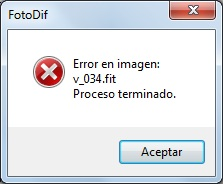

Hay varios motivos que pueden obligar al programa a detenerse con este informe. FotoDif es capaz de seguir a lo largo de la serie pequeños desplazamientos del campo, pero puede ser que hayamos hecho una parada para recentrar, provocando un salto mayor que su tolerancia, puede que se haya nublado, puede...

> **Importante: Control de tolerancia de errores.** En [Configuración / fotometría](http://www.astrosurf.com/orodeno/fotodif/fotodif.html#foto) hay un control deslizante que sirve para ajustar la tolerancia del control de errores. Se puede fijar entre los valores 1 y 9, siendo 1 el más relajado y 9 el más estricto.

En todos los casos, hay que seguir una serie de pasos para continuar con garantías:

1. Anotar el nombre de la imagen que provocó el fallo.

2. Averiguar el origen del mismo examinando la imagen anterior y las siguientes y actuando en consecuencia: Si la imagen es correcta pero tiene el campo desplazado continuaremos a partir de esta, si esta o las siguientes imágenes se hay estropeado, por ejemplo por el paso de nubes, lo más conveniente es eliminarlas del disco y dejar a partir de la siguiente en buenas condiciones.

    A continuación:

3. Volver a "Lista de estrellas" y seleccionar las imágenes a partir de la que queramos procesar hasta el final, pero teniendo cuidado de **desmarcar la casilla "Primera serie"**. En nuestro caso, el error se debió a un desplazamiento del campo, la imagen que falló es correcta, así que abrimos la lista a partir de ella.

4. Volver a "Selección de estrellas". Como estamos midiendo la segunda serie, el programa se comportará de una manera diferente, abrirá una ventana como esta,

    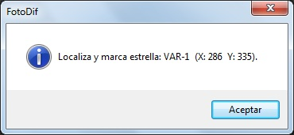

    Al pulsar sobre la estrella solicitada, el programa localizará y marcará el resto a partir de su posición.

    Si durante el proceso de marcaje manual se seleccionó más de una estrella manual, el programa da la oportunidad de emplear dos estrellas para la localización de las demás. Este procedimiento permite **corregir giro y escala**, además de desplazamientos lineales. Para ello presentará una segunda ventana similar a la anterior:

    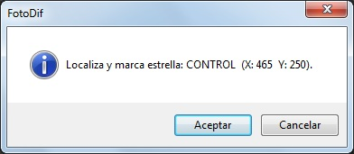

    Si pulsamos sobre "Aceptar" el programa permitirá marcar la segunda estrella, pero si "cancelamos", continuará la localización sólo con la primera, la seleccionada según el apartado anterior.

    Para localizar las estrellas puede servir la imagen del campo que grabamos en la primera selección.

    > **Importante: coordenadas.** Las coordenadas que aparecen en la ventana corresponden a la posición de la estrella en la última imagen procesada. Como pudo haber desplazamientos, las consideraremos sólo como referencia.

5. Volvemos a pulsar "Proceso". Si hay más interrupciones seguiremos el mismo procedimiento hasta llegar al la última imagen. Aparecerá el rótulo "Finalizado".

Si a pesar de nuestros cuidados alguna de las variables o estrellas de calibrado ha alcanzado el límite de linealidad, aparecerá una ventana dando cuenta de esta circunstancia. Si el problema afecta sólo a las estrellas de calibrado, tal vez sea posible repetir el proceso de medida empleando estrellas más débiles.

## Guardar y recuperar datos

El proceso de medida de una larga serie de imágenes puede ser largo y tedioso. Lo más conveniente en este momento es "Guardar los datos" para poder recuperarlos cuando sea necesario sin tener que volver a medir. La operación de recuperación dejará el programa en el mismo estado que cuando se guardaron.

> **Importante: recuperación de varias series de datos.** FotoDif permite la apertura de varias series de datos, que pueden ser, por ejemplo, de varios días diferentes. El objetivo principal de esta funcionalidad es aplicar la búsqueda de variables de largo periodo. Es una condición imprescindible que las cabeceras de todas las series sean idénticas, es decir que contengan las mismas estrellas y en el mismo orden. El procedimiento para conseguir esto es el siguiente:

- La primera vez que seleccionemos estrellas se hará de manera manual (primera serie). A continuación "guardaremos" las posiciones.
- En las siguientes ocasiones, días, etc, la localización de las estrellas se hará mediante la "recuperación" de posiciones.

Sólo de esta manera queda asegurado que las estrellas sean las mismas y con los mismos nombres.

## Gráficos

Pulsando sobre el botón correspondiente, se abre una ventana con más o menos este aspecto:

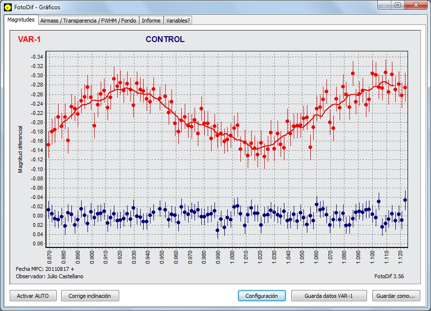

Las tres primeras pestañas de la parte superior muestran por orden: este gráfico, un conjunto de cuatro gráficos con los datos que se indican y un informe numérico configurable. De "Variables?" nos ocuparemos más adelante.

En cuanto a los botones de la parte inferior:

- "**Guardar como...**" permite grabar la gráfica en formato gif. Guardar datos VAR-1 (el nombre de la primera variable), permite guardar los datos, en un formato similar al de la ventana principal, es decir, como procedentes del proceso de las imágenes, pero sólo de la primera estrella. Veremos que esto es importante más adelante, al hablar del análisis de periodos.
- "**Configuración**" abre una ventana flotante que permite modificar varios aspectos de la visualización, tales como elegir entre magnitud relativa, absoluta, flujos relativos o flujos absolutos expresados en cuentas(1), elegir las estrellas a representar, agrupar puntos por cantidad o tiempo, cambiar el aspecto y color de los símbolos, etc. En este caso he aplicado una media móvil a la variable y he separado ambas estrellas para facilitar la visualización. Alguno de los cambios que se realizan en esta ventana se reflejan en los informes, por ejemplo, el formato de la fecha.

> **(1)** FotoDif desconoce algunos datos esenciales para calcular los flujos en las unidades correctas, W/m²/s, tales como el diámetro del objetivo, factor de transmisión de la óptica o ganancia de la cámara. Por ello ofrece este dato en cuentas. No es la misma unidad pero es proporcional, así que se pueden establecer comparaciones relativas entre estrellas.

### Borrado de puntos

Es posible borrar algún punto que por cualquier motivo sea claramente erróneo. Basta con hacer clic con el ratón sobre él para que aparezca una ventana con los datos y un botón para confirmar el borrado.

## Corrección de la inclinación

Por diferentes motivos, sobre todo relacionados con la extinción atmosférica y la diferente altura a la que se tomaron las imágenes, pueden aparecer series inclinadas cuando "sabemos" que deben ser horizontales, como en esta simulación preparada con datos de la observación de un tránsito cedidos por Ramón Naves.

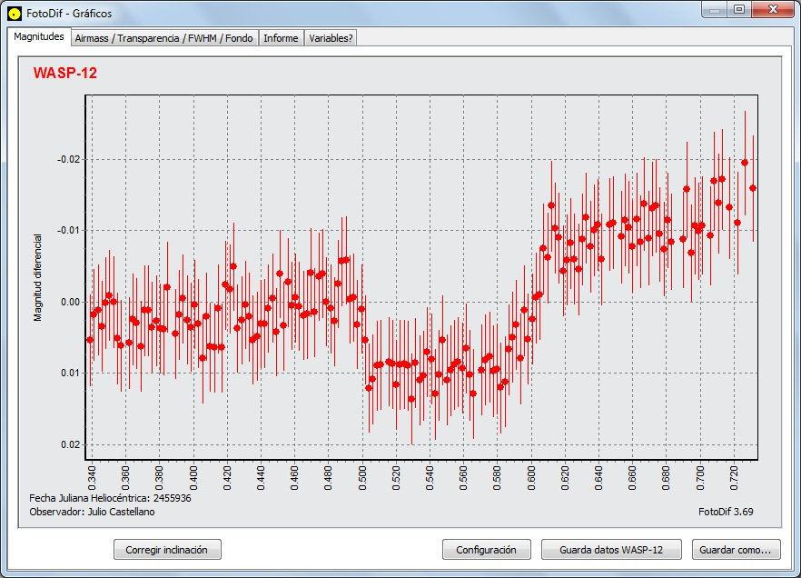

Al pulsar el botón "Corregir inclinación", el panel de la parte inferior de la ventana es sustituido por este otro:

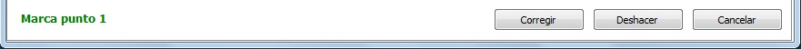

El procedimiento es sencillo. Sobre la curva hay que definir una o dos zonas (en este caso fuera del tránsito) sobre las que el programa calculará una recta que después restará de los datos. Para ello se marcarán sobre la gráfica dos o cuatro puntos que determinarán las zonas empleadas para el cálculo, por ejemplo:

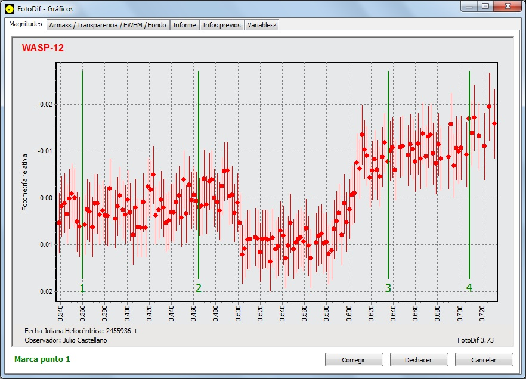

Para marcar cada punto basta con pulsar sobre la gráfica y el punto indicado por el rótulo "Marcar punto..." quedará señalado Una vez seleccionadas las zonas adecuadas, puntos 1-2 para la primera o única y puntos 3-4 para la segunda, el botón "Corregir" calculará y aplicará la corrección. El botón "Deshacer" elimina cualquier corrección anterior y "Cancelar" permite abandonar el proceso sin cambios. Este sería el resultado después de la corrección:

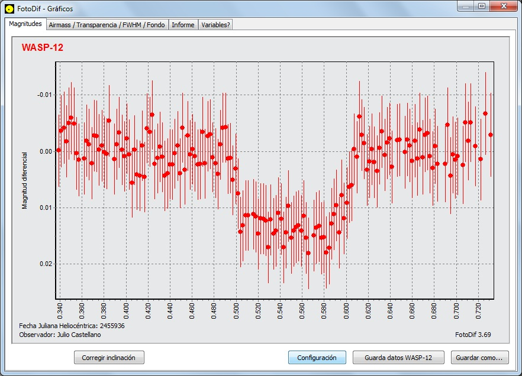

> **Importante:**
    - En el caso de que haya dos estrellas en la gráfica la corrección sólo afecta a la primera.
    - La corrección es una interpretación de las medidas, no un cambio real, por lo tanto se refleja en la gráfica y los informes pero no se conserva al cambiar la clase de fotometría visualizada ni al cambiar de estrella.

Desde [este enlace](http://www.astrosurf.com/orodeno/fotodif/inclinacion.txt) puedes descargar un archivo de datos para practicar la corrección de inclinación.

**Más gráficos**, con información adicional:

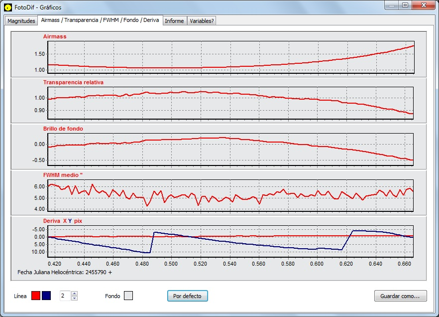

## Informes

Bajo la pestaña correspondiente se encuentra todo lo necesario para confeccionar informes los informes correspondientes a la gráfica que se está visualizando:

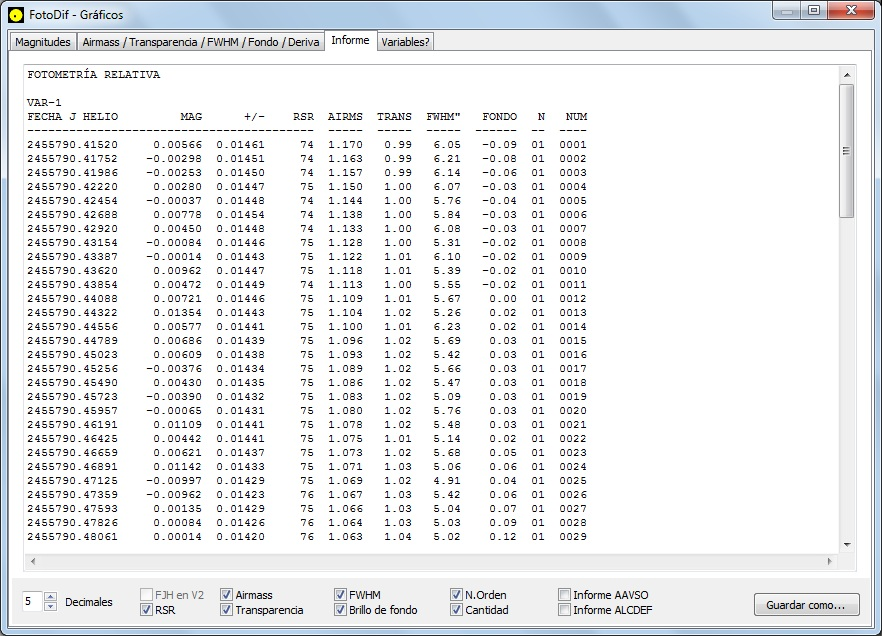

y en cuya parte inferior se encuentran varios selectores que permiten configurar el informe según nuestras necesidades.

### Informes en formato AAVSO

Pulsando el selector correspondiente se abre esta ventana:

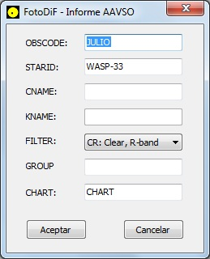

Cuyos campos son completados por FotoDif cuando los datos están disponibles y que pueden ser modificados según sea necesario.

Este no es el lugar adecuado para explicar con detalle los requerimientos que la AAVSO impone para sus informes ni las incompatibilidades entre las distintas combinaciones posibles (fotometría diferencial o absoluta (estándar según la terminología de la AAVSO), una o más estrellas de calibrado (comparación) y presencia o no de estrella de control. Para ello me remito a la web de la [AAVSO](http://www.aavso.org/) y en concreto a estos dos documentos: [AAVSO CCD Observing Manual](http://www.aavso.org/sites/default/files/CCD_Manual_2011_revised.pdf) y [AAVSO Extended File Format](http://www.aavso.org/aavso-extended-file-format).

FotoDif vigilará en la medida de lo posible la coherencia de los datos suministrados con la clase de observación, e informará si alguna incompatibilidad impide la confección del informe o procederá a su confección:

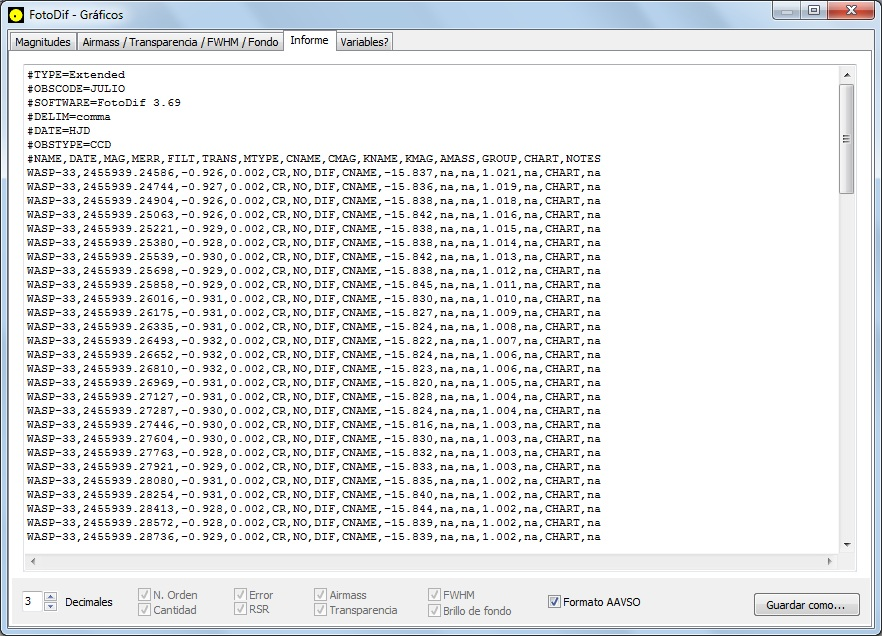

## Informes en formato ALCDEF

Con esta opción, FotoDif permite la confección de informes en el formato [ALCDEF](http://www.minorplanet.info/alcdef.html), destinados a la base de datos de curvas de luz de asteroides gestionada por el [MPC](http://minorplanetcenter.net/light_curve).

En primer lugar se abre una ventana que recoge los campos que aparecerán en la cabecera del informe:

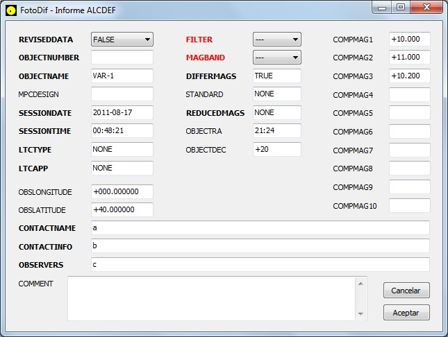

Aparecen todos los campos obligatorios, con el nombre en negrita, y los opcionales para los que FotoDif dispone de información relevante. El programa revisa la presencia de los datos obligatorios y la consistencia de todos, señalando en rojo los que han que completar o corregir antes de confeccionar el informe. FotoDif no permitirá la confección del informe mientras no se resuelvan todas las incidencias.

## Proceso automático

Esta característica de FotoDif está pensada para los usuarios más impacientes... o los que quieran monitorizar de una mirada el estado de la captura de imágenes.

En esencia realiza un procesado ordinario, pero con la diferencia de que queda esperando la llegada de nuevas imágenes, las procesa e incorpora sus datos al gráfico. Los detalles que hay que tener en cuenta:

- Se activa con el botón "Activar AUTO". Como el propósito es realizar una medida en tiempo real, este botón sólo está disponible después de realizar un proceso de verdad, no después de "Recuperar datos". El mismo botón sirve para desactivar esta función.
- Antes de utilizar esta función, tal vez sea necesario establecer alguna condición de filtrado en la sección correspondiente de la ventana de configuración, para excluir algunas imágenes:

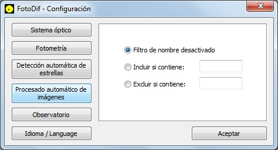

Por ejemplo, es posible que el programa de captura con preprocesado automático deje todas las imágenes en la misma carpeta. En este caso nos interesa medir sólo las tratadas y desechar las crudas.

- Para iniciar el proceso es necesario medir de la manera ordinaria al menos una imagen en la carpeta de captura. A continuación podemos pasar al gráfico, activar el botón y continuar con la captura de imágenes.
- El proceso automático está afectado por las mismas condiciones de error que el manual. Por lo tanto puede detenerse por los mismos motivos que aquel. En este caso el procedimiento a seguir para reanudar la monitorización es el mismo: se determina el motivo del fallo, se eliminan las imágenes defectuosas en su caso y se miden las pendientes. Después podemos volver a "Gráficos" y activar el botón.
- Una vez terminada la captura, la situación es la misma que después de un proceso ordinario. Es conveniente ir a la ventana principal y "Guardar datos".

## Búsqueda de variables

Después de dedicar varias horas a la captura de una serie larga de imágenes, por el precio de un poco más de tiempo de proceso es posible utilizar la herramienta auxiliar de búsqueda de variables para analizar todas las estrellas de campo en busca de variables de periodo corto. El "Proceso" es el mismo, sólo que antes haremos que el programa seleccione todas las estrellas del campo y después emplearemos algunas herramientas para su análisis. Para empezar, tendremos que ajustar algunos números en la sección de detección automática de estrellas de la ventana de configuración:

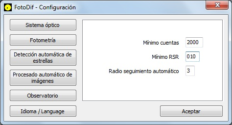

El mínimo de cuentas y RSR no necesitan explicación aunque tal vez necesiten determinarse experimentalmente dependiendo de las circunstancias de la observación, tiempo de exposición, calidad del cielo, etc. El radio de seguimiento automático indica la distancia en pixeles donde el programa buscará, durante el proceso, cada estrella en la foto siguiente de la serie. Si encuentra algún centroide dentro de ese radio considerará que es la misma estrella. El valor recomendado es 2.

### Selección automática de estrellas

En la ventana de selección de estrellas hay un selector "Todas" que hasta ahora no habíamos comentado. Evidentemente sirve para instruir a FotoDif para que seleccione todas las estrellas del campo, con los criterios fijados en la configuración, para su medida y análisis.

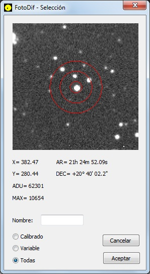

En primer lugar debemos seleccionar las estrellas de calibrado y variables manuales de nuestro interés. Es necesario que al menos exista una variable manual como referencia para el proceso de "segundas series". Una vez finalizada la selección manual pulsaremos sobre una estrella cualquiera en la imagen y seleccionaremos "Todas" en la ventana de selección y al "Aceptar", FotoDif analizará toda la imagen y asignará un nombre automático a las estrellas que encuentre.

> **Importante: nombre automático.** Con el fin de facilitar la localización posterior de las estrellas en la imagen, el nombre automático contiene las coordenadas X e Y del centroide en la primera imagen.

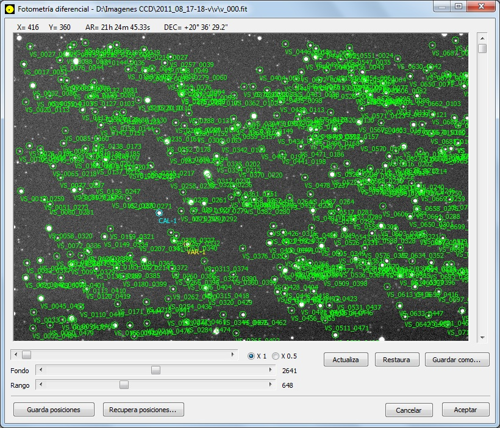

Si comprobamos que ha seleccionado pocas estrellas o demasiadas (muy débiles), podemos "Cancelar", revisar los parámetros de detección automática de estrellas y repetir.

Una vez hemos terminado la selección automática de estrellas, podemos "Procesar" y "Guardar datos" antes de pasar la la búsqueda de variables.

### Variables?

Si con todas las estrellas de campo procesadas vamos a la pestaña "Variables?" veremos algo así:

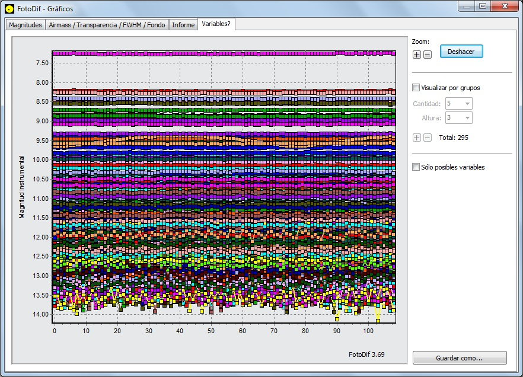

Es posible que se empiece a distinguir alguna cosa, pero podemos aclarar un poco la zona de trabajo empleando los controles de la parte derecha:

- Podemos emplear los botones de zoom, y la rueda del ratón para desplazar la gráfica, pero con tantísimas estrellas no es recomendable.
- En la siguiente sección encontramos todo lo necesario para visualizar las estrellas por grupos. Si se activa la casilla de selección, FotoDif dibujará la gráfica de las estrellas seleccionadas separándolas verticalmente de manera uniforme. La escala de magnitudes deja de tener sentido y desaparece. Podemos ver algo así:

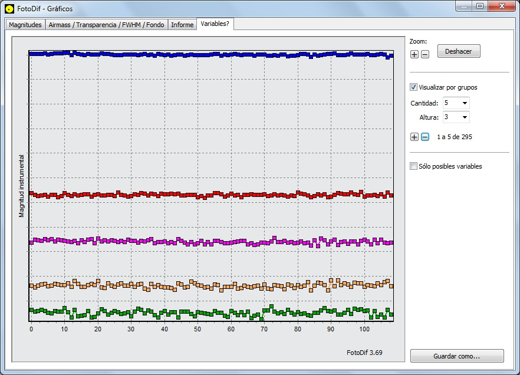

- Durante el procesado de todas las estrellas es posible que se produzcan ciertos errores. Es posible que dos estrellas muy próximas se contaminen mutuamente e incluso que la más brillante capture el centroide de la más débil. FotoDif intenta eliminar de la visualización estas estrellas, aunque no siempre lo consigue. Algunos ejemplos:

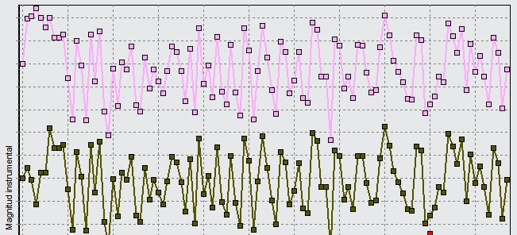

Estrellas mutuamente contaminadas: después de unas cuantas imágenes la gráfica es idéntica

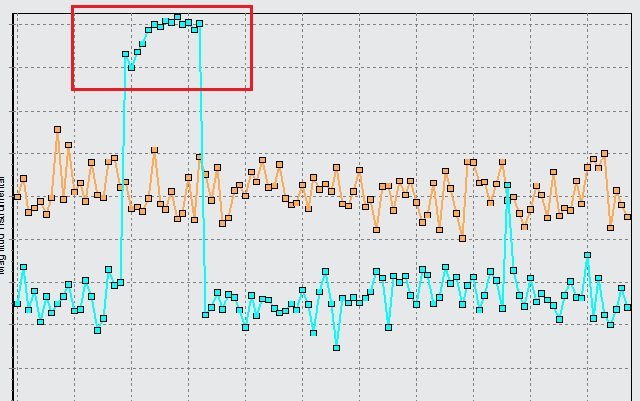

Captura temporal del centroide por una estrella más brillante.

- Por último podemos pedir a FotoDif que muestre sólo las posibles variables.

> **Importante:** El programa es bastante generoso en este apartado con el propósito de no pasar por alto ninguna variable real, por lo tanto, es posible que genere algunas detecciones falsas.

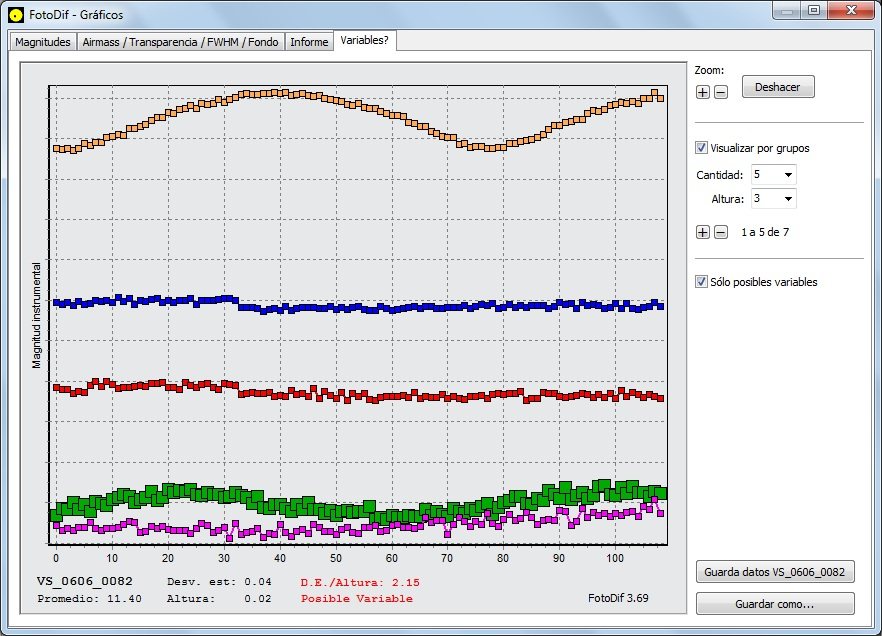

> **Importante.** En cualquier momento, al pulsar sobre la serie correspondiente a una estrella, el programa destaca la gráfica, muestra algunos datos relevantes en la parte inferior y un botón que permite guardar por separado los datos de esa estrella. Si en esta situación seleccionamos la pestaña "Magnitudes", podremos ver su gráfica por separado..

> **Importante.** A partir de este momento manda el sentido común: hay que examinar las imágenes para comprobar que la posible variable no está en realidad contaminada por una estrella próxima e incluso puede ser conveniente volver a medir toda la serie de datos pero marcando manualmente sólo la o las posibles variables.

## Análisis de periodo

Esta ventana reune toda la funcionalidad necesaria para el cálculo y análisis de periodo.

Los datos necesarios deben tener el formato fecha juliana - magnitud, como por ejemplo, los generados por el programa desde Gráficos / Informe, y también se pueden emplear datos externos siempre que respeten ese formato. Desde este enlace podemos descargar los que han servido para elaborar esta parte del manual y pueden emplearse para practicar.

> **Importante.** Los archivos de entrada de datos pueden contener líneas con otra información, que será descartada por el programa. Así mismo, las líneas de datos pueden contener información adicional después de la magnitud, que tampoco será tenida en cuenta. Por ejemplo, los informes de FotoDif, que pueden ser empleados tal cual, sin necesidad de modificaciones previas.

Este es el aspecto de la ventana una vez cargados los datos:

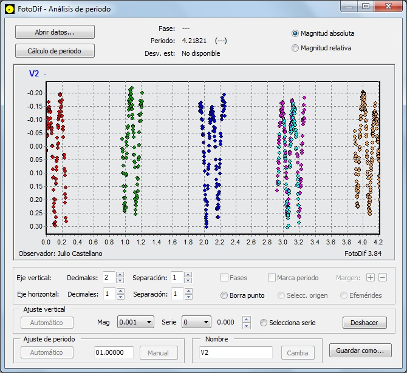

Vemos que FotoDif ha separado las noches por colores y ha calculado un periodo máximo provisional de 4.2 días. Tan provisional como que es el tiempo que ha transcurrido entre la primera medida y la última.

El botón "Cálculo de periodo" da paso a esta ventana en la que aparecen algunos datos sobre al cálculo a realizar. Todos los valores son modificables aunque los que aparecerán por defecto suelen dar buenos resultados.

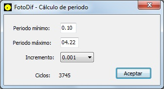

Después de "Aceptar" y de tras el cálculo correspondiente veremos el resultado:

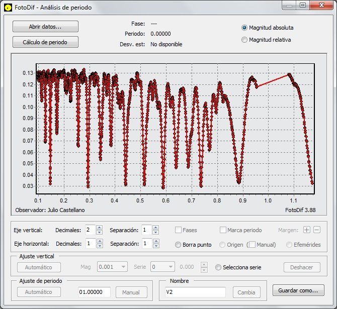

FotoDif ha calculado todos los periodos posibles dentro del rango específicado en la ventana anterior y para cada uno de ellos la desviación estándar de las medidas. Vemos que el máximo posible se ha reducido hasta casi 1.2 e incluso que hay una zona "vacía" entre 0.95 y 1.09.

> **Importante.** Para conseguir una buena aproximación del periodo correcto es necesario tener datos de más de un periodo real. Para un valor concreto, si no hay más del 30% cubierto con al menos dos observaciones, el programa considera que la desviación estándar no es válida. Por eso, en este ejemplo, ignora los periodos más largos que 1.2 y entre 0.95 y 1.09.

Es posible refinar la búsqueda de periodos cambiando manualmente los valores de la ventana de cálculo. Si por ejemplo nos intersa la zona 0.1-0.4 podemos marcar estos valores para obtener una ampliación de esa parte:

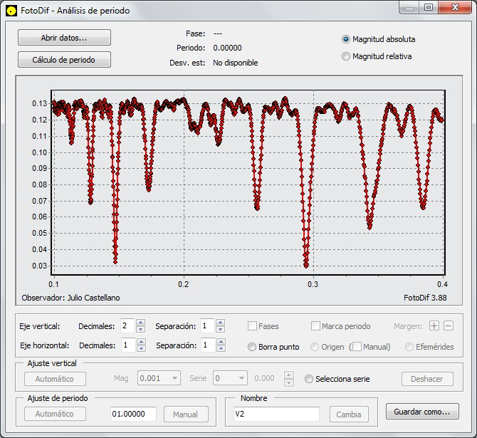

Una vez calculada la gráfica, nuestra atención se debe fijar en sus mínimos. Uno de ellos seguramente estará cerca del periodo verdadero. Si pulsamos sobre el primero aparece esto:

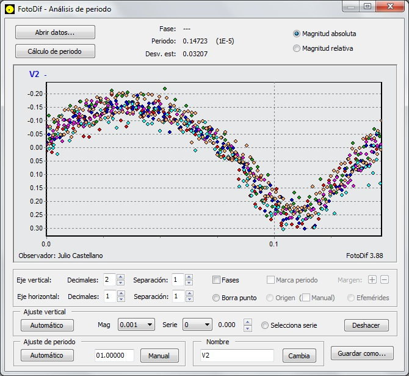

Parece un buen ajuste para un periodo de 0.147, pero...

> **Importante.** La mayoría de las eclisantes y la mayoría de los asteroides producen curvas con dos máximos y dos mínimos. Si la curva es muy simétrica, FotoDif encontrará un buen ajuste para un periodo la mitad del verdadero. Por motivos parecidos también encontrará buenos ajustes para periodos múltiplo del verdadero. Así, en la mayoría de los casos el periodo correcto corresponderá al primer o segundo mínimo.

Para comprobar otro mínimo volvemos a pulsar sobre "Cálculo de periodo" y aceptamos. Si no cambiamos ningún dato. FotoDif presentará de nuevo el gráfico de mínimos sin volver a calcularlo. Pulsando sobre el segundo mínimo comprobamos que, en efecto, se trata de una variable con la curva de fase casi simétrica:

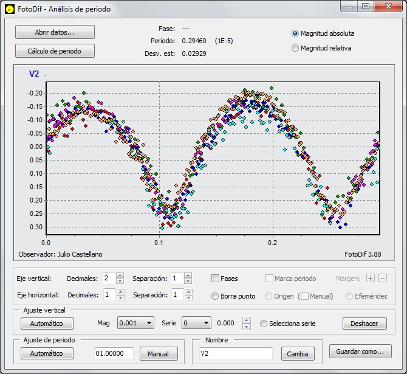

### Ajuste automático

Una vez hemos calculado un periodo bastante ajustado es conveniente dejar que el programa lo refine un poco más. Para ello pulsaremos sobre Ajuste vertical, / Automático y Ajuste de periodo / Automático. Ambas correcciones tienen una pequeña influencia mutua, de manera que tal vez los mejores resultados se alcancen repitiendo la secuencia una vez más. La curva adquiere un aspecto mejor, y la desviación estándar de los puntos lo confirma:

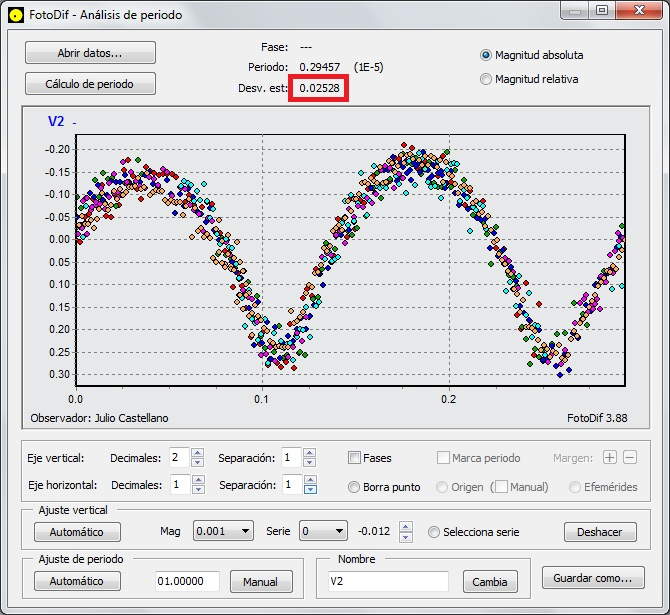

### Ajuste manual

Si es necesario ajustar manualmente el periodo podemos emplear las flechas del teclado. Con las verticales cambiamos la precisión del ajuste y con las horizontales el periodo. Los números en la parte superior de la ventana muestran los cambios. Lo que buscaremos será la menor desviación estándar posible.

También es posible modificar la altura de cada serie, también con el objetivo de reducir la desviación estándar. Hay un botón que lo hace automáticamente y también es posible buscar un ajuste manual desplazando las series una a una. Para ello hay que marcar el selector "Seleccionar serie", a continuación hacer clic sobre la serie que nos interese desplazar y emplear los controles de la sección "Ajuste vertical"

### Otras funciones

- Nombre de la variable. Si los archivos de datos proceden de FotoDif, el programa extraerá el nombre de la variable. Si este falta o no es correcto, podemos cambiarlo empleando la casilla de texto y el botón "Nombre".
- El selector "Fases" permite construir el verdadero diagrama de fases de la curva.
- El selector "Marca periodo" dibuja un par de líneas verticales en fase=0 y fase=1
- Es posible borrar un punto claramente erróneo. Basta con activar el selector correspondiente y hacer clic sobre el punto.

### Origen

Para definir el punto de fase=0 basta con activar el selector "Selec. origen" y hacer clic sobre la zona de la gráfica que interese. En eclipsantes suele ser el mínimo, en asteroides el máximo. Por ejemplo:

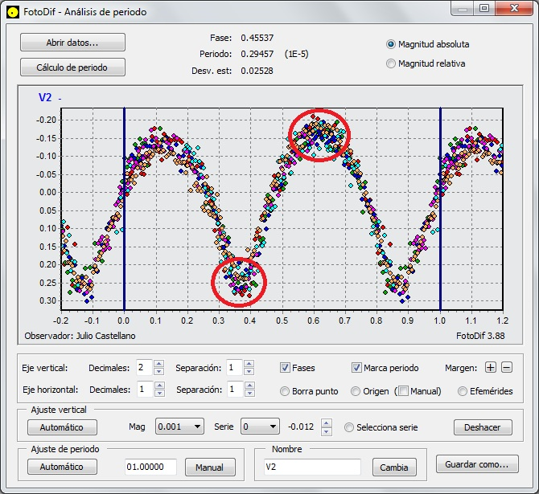

En este momento, FotoDif calculará la época para el mínimo o máximo seleccionado con su error, y también el error para el periodo considerado, siguiendo el método de [L. Winkler](http://adsabs.harvard.edu/full/1967AJ.....72..226W), con lo que podemos dar por terminado el análisis del periodo:

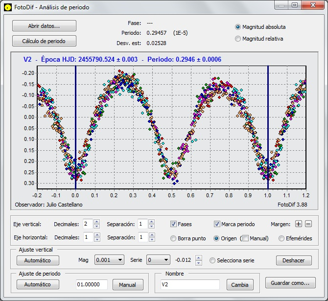

> **Importante:** El algoritmo de Winkler se basa en la simetría de los valores en el punto de fase=0. En algunos casos esta simetría no existe y el algoritmo puede fallar. En estos casos se puede seleccionar el punto de fase=0 de manera manual, marcando la casilla correspondiente. Al tratarse de una selección manual, el error mostrado equivaldrá a +/- un pixel de la gráfica.

### Cálculo de efemérides

Es posible preparar unas efemérides para una parte concreta de la curva. Basta con activar el selector "Efemérides" y hacer clic sobre la zona de interés para que se abra esta ventana que permite el cálculo:

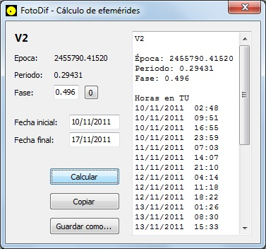

La "Fase" es la correspondiente al punto que se marcó. Todos los datos se pueden modificar antes de hacer el cálculo. Los resultados se pueden copiar o guardar en un archivo de texto.

## Para practicar

[Imágenes](http://www.astrosurf.com/orodeno/fotodif/v.rar)
[Corrección de la inclinación](http://www.astrosurf.com/orodeno/fotodif/inclinacion.txt)
[Análisis de periodo](http://www.astrosurf.com/orodeno/fotodif/analisis.rar)

## Descarga

[FotoDif 3.135](http://www.astrosurf.com/orodeno/fotodif/Setup_FotoDif_3.135.exe)
[Actualizacion FotoDif 3.135](http://www.astrosurf.com/orodeno/fotodif/FotoDif%203.135.zip) (solo ejecutable)

## Agradecimientos

A Esteban Reina, Josep María Aymamí, Quique Herrero, Ramón Naves, Sebastián Otero y Francisco Soldán (por riguroso orden alfabético) por su gran dedicación a las pruebas del programa y por las importantes mejoras que han aportado con sus ideas y sugerencias.
